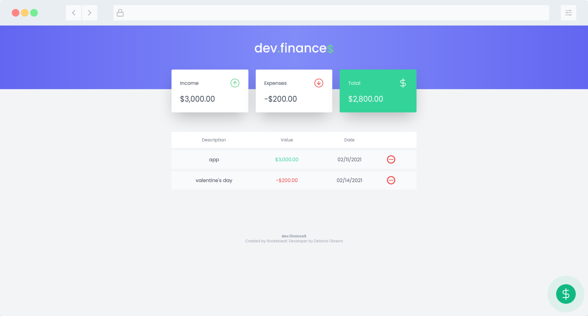

<p align="center"> </p>

## :star2: About

#### dev.finances is a financial control application, where you can register and delete transactions and view the incoming and expenses balance

## :rainbow: Preview

- [Live preview here](https://maratonadiscover-alpha.vercel.app/)

<p align="center"></p>

## :computer: Technologies
- HTML
- TAILWIND CSS
- CSS
- JAVASCRIPT

## :wrench: How to use

```bash
# clone repository
git clone https://github.com/sihann/maratonadiscover.git

```
## :space_invader: Issues

Let me know if you find some issue
[Report here](https://github.com/sihann/maratonadiscover/issues)

####  :pushpin: License

[MIT License](https://github.com/sihann/maratonadiscover/blob/main/LICENSE)

<p align="center">Make with :heart_purple: by Delania Oliveira.</p>